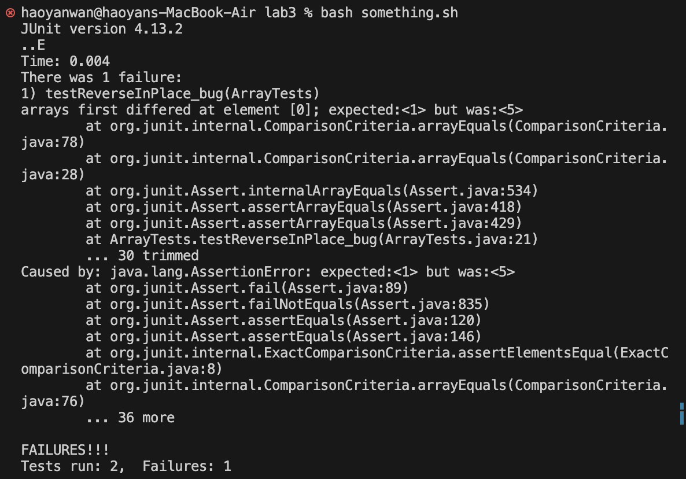

# Lab 3 Blog

## Part 1 Bugs

### Failure Inducing Input:
```
  @Test
  public void testReverseInPlace_bug() {
      int[] arr = {1, 2, 3, 4, 5};
      int[] rev = {5, 4, 3, 2, 1};
      
      ArrayExamples.reverseInPlace(arr);
      
      assertArrayEquals(rev, arr);
  }
```

### Non-Failure Inducing Input:
```
    @Test 
	public void testReverseInPlace() {
    int[] input1 = { 3 };
    ArrayExamples.reverseInPlace(input1);
    assertArrayEquals(new int[]{ 3 }, input1);
	}
```

### The symptom, as the output of running the tests
 


### The bug before and after:
before:
```
    static void reverseInPlace(int[] arr) {
    for(int i = 0; i < arr.length; i += 1) {
      arr[i] = arr[arr.length - i - 1];
    }
  }
```
after:
```
    static void reverseInPlace(int[] arr) {
    for (int i = 0; i < arr.length / 2; i++) {
        int temp = arr[i];
        arr[i] = arr[arr.length - i - 1];
        arr[arr.length - i - 1] = temp;
    }
}
```

Why it fixed the issue:
    In the original code the array was not using a temp variable to store the original values as it reverses. The result was that as it reversed the later half of the array, it wasn't using the original array values anymore. Adding a temp variable solves this.

## Part 2 - Researching Commands (find)

### Option 1 -name
SOURCES: MAN 
Command and output:
```
    find ./technical -name "*2-12.txt"

./technical/biomed/1471-2148-2-12.txt
./technical/biomed/1471-2091-2-12.txt
./technical/biomed/1471-2199-2-12.txt
./technical/biomed/1471-2202-2-12.txt
./technical/biomed/1471-2407-2-12.txt
./technical/biomed/1475-925X-2-12.txt
./technical/biomed/1471-2121-2-12.txt
./technical/biomed/1471-2156-2-12.txt
./technical/biomed/1471-2350-2-12.txt
./technical/biomed/1471-2431-2-12.txt
```

What its doing and why it is useful:
It looped through the entire directory and found all of the files with file names that ended in 2-12.txt. This is very helpful because if the file names are coded by date, then we could use this method to find files for specific dates.

SOURCES: MAN 
Command and output:
```
    find ./technical -type d -name "biomed"
./technical/biomed
```

What its doing and why it is useful:
It is looping through the entire directory and listing all of the directories that has the name biomed. This could be useful if there are organized directories for genres of books and we want to see if a specific genre exist. 

### Option 2 -type
SOURCES: MAN 
Command and output:
```
    find ./technical -type d
./technical
./technical/government
./technical/government/About_LSC
./technical/government/Env_Prot_Agen
./technical/government/Alcohol_Problems
./technical/government/Gen_Account_Office
./technical/government/Post_Rate_Comm
./technical/government/Media
./technical/plos
./technical/biomed
./technical/911report
```

What its doing and why it is useful:
It is listing all of the directories that are under this directory, it also shows all of the sub directories. This is useful because we can quickly see what directories exist which can help us understand the strucutre of the filesystem. 

SOURCES: MAN 
Command and output:
```
    find ./technical -type f

./technical/911report/chapter-7.txt
./technical/911report/chapter-9.txt
./technical/911report/chapter-8.txt
./technical/911report/preface.txt
./technical/911report/chapter-12.txt
./technical/911report/chapter-10.txt
./technical/911report/chapter-11.txt
...
```

What its doing and why it is useful:
This will return all of the file names that exist under the directoriy, this also works on all subdirectories. This is useful if you just want the file links and not the directories.

### Option 3 -mtime 
SOURCES: MAN 
Command and output:
```
    find technical -mtime -7
./technical/911report/chapter-7.txt
./technical/911report/chapter-9.txt
./technical/911report/chapter-8.txt
./technical/911report/preface.txt
./technical/911report/chapter-12.txt
./technical/911report/chapter-10.txt
./technical/911report/chapter-11.txt
...
```

What its doing and why it is useful:
It is looping through all the files and finding the files that have been edited within the last 7 days. This is useful if you are trying to filter through the files that you work with frequently.

SOURCES: MAN 
Command and output:
```
    find technical -type d -mtime -7
technical
technical/government
technical/government/About_LSC
technical/government/Env_Prot_Agen
technical/government/Alcohol_Problems
technical/government/Gen_Account_Office
technical/government/Post_Rate_Comm
technical/government/Media
technical/plos
technical/biomed
technical/911report
...
```

What its doing and why it is useful:
It is looping through all the directories and finding the directories that have been edited within the last 7 days. This is useful if you are trying to filter through the directory that you work with frequently.

### Option 4 -size
SOURCES: MAN 
Command and output:
```
    find technical -type d -size -10k 
technical
technical/government
technical/government/About_LSC
technical/government/Env_Prot_Agen
technical/government/Alcohol_Problems
technical/government/Gen_Account_Office
technical/government/Post_Rate_Comm
technical/government/Media
technical/plos
technical/911report
```

What its doing and why it is useful:
It will loop through all of the directories and sub directories and find all of the directories that are less than 10k in size. This is useful if you are trying to identify which directories have a lot of files which might be a sign to have furthur subdivision. 

SOURCES: MAN 
Command and output:
```
    find technical -type f -size +200k 
technical/government/About_LSC/commission_report.txt
technical/government/Env_Prot_Agen/bill.txt
technical/government/Gen_Account_Office/GovernmentAuditingStandards_yb2002ed.txt
technical/government/Gen_Account_Office/Statements_Feb28-1997_volume.txt
technical/government/Gen_Account_Office/d01591sp.txt
technical/911report/chapter-13.4.txt
technical/911report/chapter-13.5.txt
technical/911report/chapter-3.txt
```

What its doing and why it is useful:
It will loop through all of the directories and sub directories and find all of the files that are more than 200k in size. This is useful if you are trying to identify which files are taking alot of storage and process them accordingly. 


